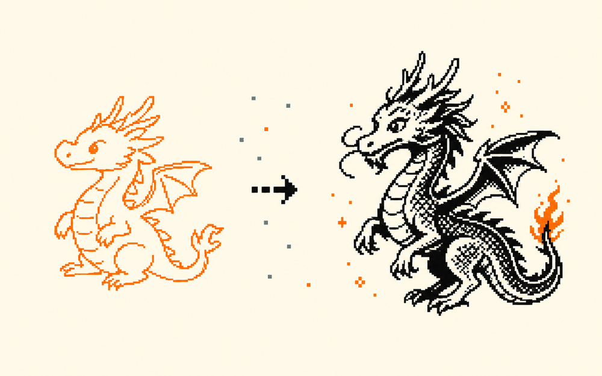

# 涂鸦变神龙  ·  Doodle to dragon

> 🎨 涂鸦成画 · 难度：入门 · 适合：小学→高中 · 约 4 个实验

## 体验（先玩）
一句话说明你会做出什么，然后去 playground 玩到结果：
**画一条歪歪扭扭的龙，AI 把它补成一张精致插画。理解 sketch→image。**

▶ Playground：https://huggingface.co/spaces/myn0908/S2I-Artwork-Sketch-to-Image-Diffusion

## 原理（它怎么工作）
_用人话讲清背后是什么，配一张示意图。别堆术语。_

TODO：补一段原理说明。

## 你能学到什么
- 草图作为“条件”引导生成（ControlNet）
- prompt 控风格、草图控构图
- AI 的“想象”从哪来

## 怎么复现（自己做）
1. 打开参考仓库：https://github.com/replicate/scribble-diffusion
2. TODO：一步步 clone / run 的说明。
3. TODO：需要的工具 / API / key。

## 陪伴形象
本卡配套形象：`cherry-smile`（Doris / Cherry 的一个表情，可做数字徽章 / NFT）。

---
_这张卡是 ai-atlas 的一个条目。想改进或新增卡片？欢迎提 PR，见根目录 README。_
