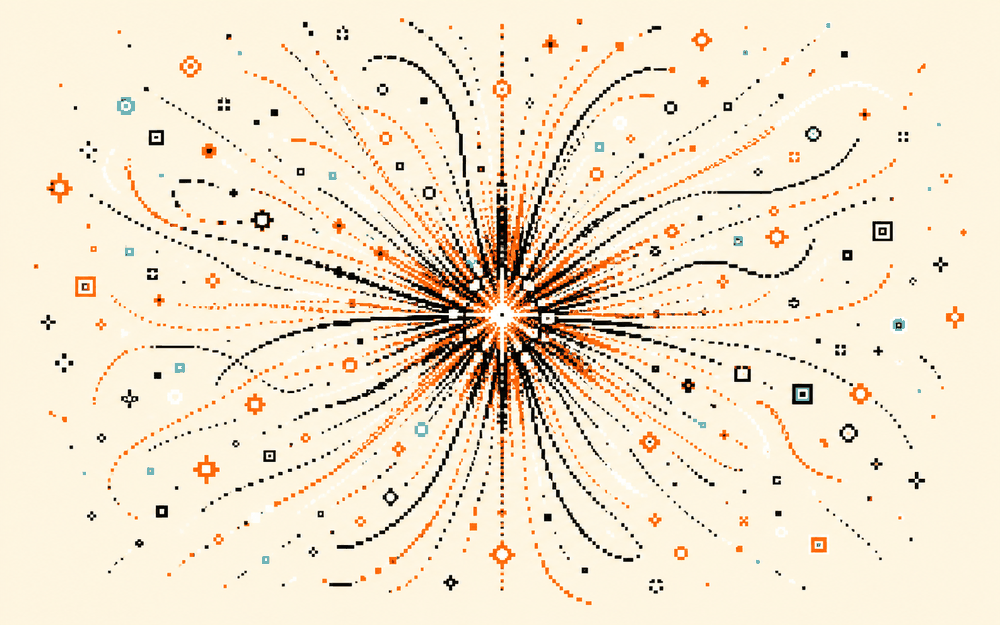

# 让图形动起来  ·  Make shapes come alive

> 🎬 做个动画 · 难度：入门 · 适合：初中→大学 · 约 3 个实验

## 体验（先玩）
用几行创意代码，让粒子、线条随机地动起来——第一次感受“代码即画笔”。改一个数字，整个画面就变。

▶ Playground：https://editor.p5js.org
（库源码：p5.js https://github.com/processing/p5.js ）

## 原理（它怎么工作）
这张卡不靠 AI 模型，靠的是**创意编程（creative coding）**的一个核心心智模型：

- **`draw()` 每一帧都重画一次**。屏幕像一本快速翻页的手翻书，一秒画 60 页；你只要描述“每一页画什么”，连起来就是动画。
- **随机数 + 循环 = 生成艺术**。用 `for` 循环画很多个点，用 `random()` 给每个点一点点随机的位置/大小/方向，一堆简单规则叠起来，就“涌现”出复杂又好看的图案（就像封面这团粒子）。
- 你调的每个数字（数量、速度、随机幅度）都是一个“旋钮”，边调边看，直觉就长出来了。

一句话：不是你画出每个粒子，而是你**定几条规则，让规则自己长出画面**。这也是理解“生成”的最好起点。

## 你能学到什么
- 随机数 + 循环 = 生成式动画（涌现的直觉）
- `draw()` 每帧重画的心智模型（动画到底是什么）
- 改一个参数画面就变——参数化思维，是后面玩 AI 生成的地基

## 怎么复现（自己做）
1. **最快**：打开 https://editor.p5js.org ，把官方 examples 里任一个 sketch 贴进去，改 `draw()` 里的数字，实时看变化。免安装。
2. **系统学**：跟 The Coding Train 的 p5.js 入门（youtube / thecodingtrain.com），从画一个会动的圆开始。
3. **做一个粒子系统**：用一个数组存很多“粒子对象”（各有位置和速度），每帧更新位置 + 画出来，就是封面那种效果。
4. **接下来**：p5.js + ml5.js 就能把“动画”接上“AI”（姿态、声音控制画面）——见 `webcam-controller` 卡。
5. **需要**：只要一个浏览器 + p5.js Web Editor，零成本。

## 陪伴形象
本卡配套形象：`cherry-run`（Cherry 的一个动作，可做数字徽章 / NFT）。

---
_这张卡是 ai-atlas 的一个条目。想改进或新增卡片？欢迎提 PR，见根目录 README。_
