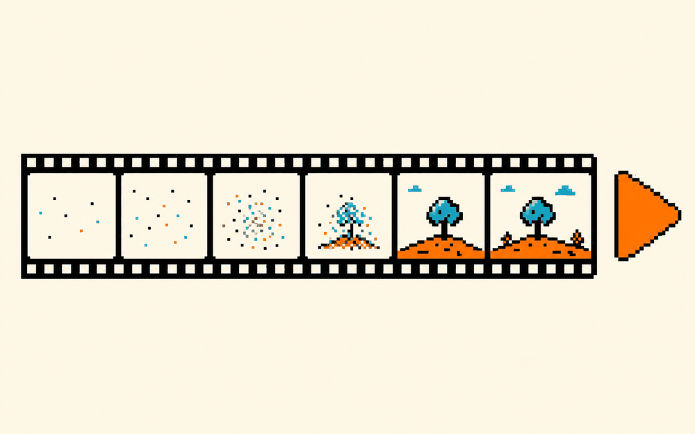

# 一句话变成动画短片  ·  A sentence becomes a clip

> 🎬 做个动画 · 难度：入门 · 适合：初中→大学 · 约 3 个实验

## 体验（先玩）
一句话说明你会做出什么，然后去 playground 玩到结果：
**输入一句话，AI 生成几秒的动画短片。理解“文生视频”是怎么回事。**

▶ Playground：https://huggingface.co/spaces/ByteDance/AnimateDiff-Lightning

## 原理（它怎么工作）
_用人话讲清背后是什么，配一张示意图。别堆术语。_

TODO：补一段原理说明。

## 你能学到什么
- prompt 如何影响运动与画面
- 扩散模型 + 运动模块的直觉
- 可 Duplicate Space 自己跑

## 怎么复现（自己做）
1. 打开参考仓库：https://huggingface.co/spaces/multimodalart/stable-video-diffusion
2. TODO：一步步 clone / run 的说明。
3. TODO：需要的工具 / API / key。

## 陪伴形象
本卡配套形象：`doris-surprise`（Doris / Cherry 的一个表情，可做数字徽章 / NFT）。

---
_这张卡是 ai-atlas 的一个条目。想改进或新增卡片？欢迎提 PR，见根目录 README。_
