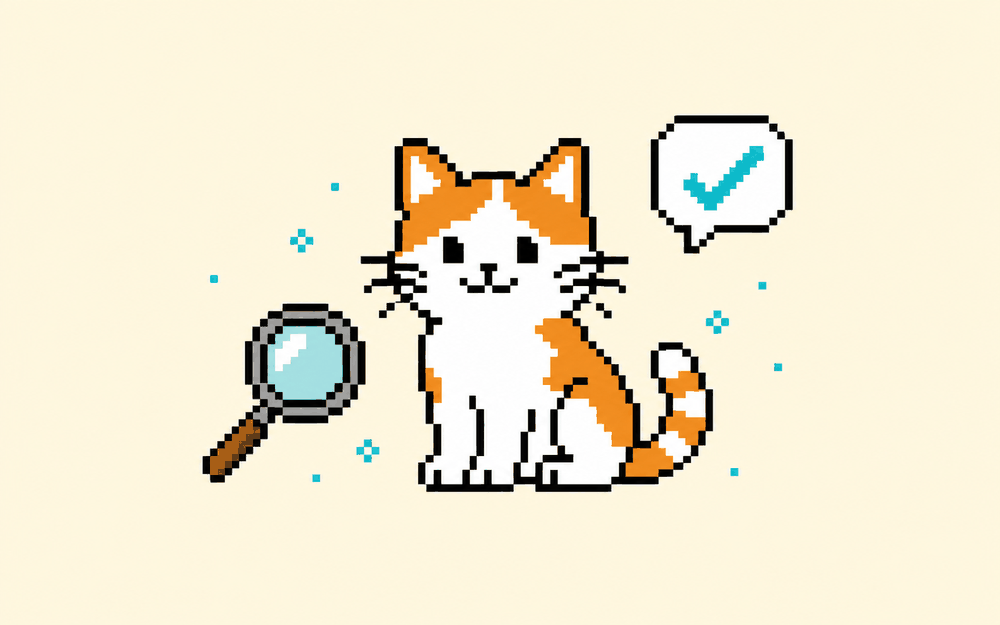

# AI 猜猜我画的啥  ·  Can the AI guess your doodle?

> 🎨 涂鸦成画 · 难度：入门 · 适合：小学+ · 约 3 个实验

## 体验（先玩）
一句话说明你会做出什么，然后去 playground 玩到结果：
**随手画，神经网络实时猜你画的是什么。第一次直观看懂“分类”。**

▶ Playground：https://quickdraw.withgoogle.com

## 原理（它怎么工作）
_用人话讲清背后是什么，配一张示意图。别堆术语。_

TODO：补一段原理说明。

## 你能学到什么
- 模型从海量涂鸦里学到了什么
- 它会在哪翻车、为什么
- 数据量与识别的关系

## 怎么复现（自己做）
1. 打开参考仓库：https://github.com/googlecreativelab/quickdraw-dataset
2. TODO：一步步 clone / run 的说明。
3. TODO：需要的工具 / API / key。

## 陪伴形象
本卡配套形象：`cherry-tilt`（Doris / Cherry 的一个表情，可做数字徽章 / NFT）。

---
_这张卡是 ai-atlas 的一个条目。想改进或新增卡片？欢迎提 PR，见根目录 README。_
