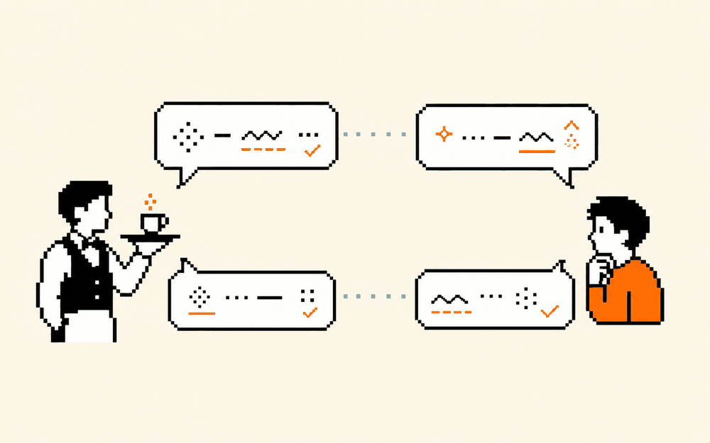

# 随身口语陪练  ·  A roleplay language tutor

> 💬 造个聊天助手 · 难度：入门 · 适合：高中→大学 / 老师 · 约 4 个实验

## 体验（先玩）
一句话说明你会做出什么，然后去 playground 玩到结果：
**做一个会角色扮演的聊天机器人：它是巴黎咖啡馆服务员，只用简单法语跟你对话并纠错。**

▶ Playground：https://aistudio.google.com

## 原理（它怎么工作）
_用人话讲清背后是什么，配一张示意图。别堆术语。_

TODO：补一段原理说明。

## 你能学到什么
- system prompt 决定“人设”
- 如何让它纠错而不打断
- 语言老师的减负用法

## 怎么复现（自己做）
1. 打开参考仓库：https://github.com/vercel/ai
2. TODO：一步步 clone / run 的说明。
3. TODO：需要的工具 / API / key。

## 陪伴形象
本卡配套形象：`doris-smile`（Doris / Cherry 的一个表情，可做数字徽章 / NFT）。

---
_这张卡是 ai-atlas 的一个条目。想改进或新增卡片？欢迎提 PR，见根目录 README。_
