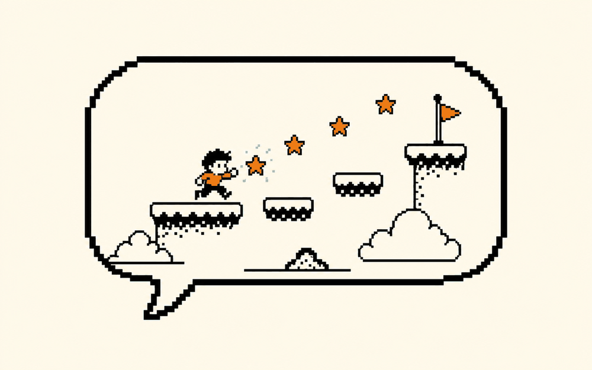

# 一句话生成小游戏  ·  A sentence becomes a game

> 🕹 做个小游戏 · 难度：入门 · 适合：初中→大专 · 约 3 个实验

## 体验（先玩）
一句话说明你会做出什么，然后去 playground 玩到结果：
**描述一个游戏，AI 生成一个能玩的网页游戏 + 素材。你来当设计师。**

▶ Playground：https://rosebud.ai

## 原理（它怎么工作）
_用人话讲清背后是什么，配一张示意图。别堆术语。_

TODO：补一段原理说明。

## 你能学到什么
- 把想法拆成“规则 + 素材 + 关卡”
- AI 生成后你怎么改
- 导出 Phaser 继续做

## 怎么复现（自己做）
1. 打开参考仓库：https://github.com/phaserjs/phaser
2. TODO：一步步 clone / run 的说明。
3. TODO：需要的工具 / API / key。

## 陪伴形象
本卡配套形象：`doris-smile`（Doris / Cherry 的一个表情，可做数字徽章 / NFT）。

---
_这张卡是 ai-atlas 的一个条目。想改进或新增卡片？欢迎提 PR，见根目录 README。_
