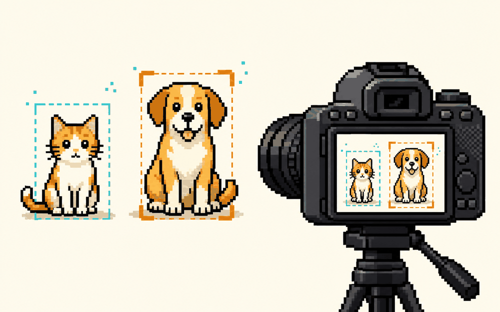

# 5 分钟教它认猫狗  ·  Teach it cats vs dogs in 5 min

> 🤖 训练你自己的 AI · 难度：入门 · 适合：小学→职校 · 约 3 个实验

## 体验（先玩）
一句话说明你会做出什么，然后去 playground 玩到结果：
**用摄像头给几张例子，训练一个自己的图像分类器，看它实时判断。**

▶ Playground：https://teachablemachine.withgoogle.com

## 原理（它怎么工作）
_用人话讲清背后是什么，配一张示意图。别堆术语。_

TODO：补一段原理说明。

## 你能学到什么
- “训练”到底在做什么
- 样本少 / 偏了会怎样（偏见）
- 导出模型接进网页

## 怎么复现（自己做）
1. 打开参考仓库：https://github.com/googlecreativelab/teachablemachine-community
2. TODO：一步步 clone / run 的说明。
3. TODO：需要的工具 / API / key。

## 陪伴形象
本卡配套形象：`doris-think`（Doris / Cherry 的一个表情，可做数字徽章 / NFT）。

---
_这张卡是 ai-atlas 的一个条目。想改进或新增卡片？欢迎提 PR，见根目录 README。_
