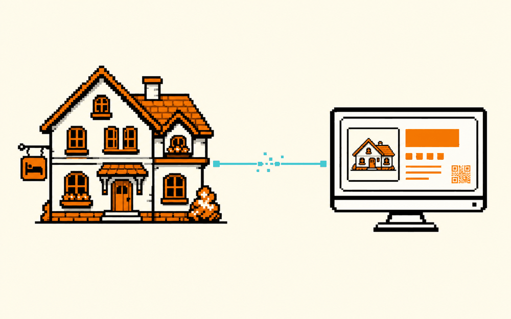

# 十分钟上线你的民宿网站  ·  Your rental site in 10 minutes

> ✨ 帮你完成一个想法 · 难度：入门 · 适合：人人 / 民宿主 · 约 4 个实验

## 体验（先玩）
房间、照片、评价、周边、你对这座城市的理解，一页搞定，还能加预订。二维码印名片，客人自己看，不用一条条重复发信息 —— 顺便帮你记住域名、帮你宣传。

▶ Playground：https://aistudio.google.com
（开源“边生成边运行”参考：Fragments by E2B https://github.com/e2b-dev/fragments ）

## 原理（它怎么工作）
你不需要“会做网站”，只需要“会描述你想要什么”。背后是 **AI 把自然语言变成能跑的网页**：

- 大模型读过海量网页代码，你说“一个介绍我民宿的单页，顶部大图、房间列表、评价、地图、一个预订按钮”，它就**生成对应的 HTML/CSS/JS（或 React）**。
- 像 E2B Fragments 这类工具更进一步：它把生成的代码**放进一个安全沙箱里当场运行**，你立刻看到效果，不满意就继续说“把预订按钮放大 / 换成暖色”。
- 满意后**部署**到静态托管（如 Cloudflare Pages），拿到一个网址；再生成一个指向该网址的**二维码**印到名片上。

一句话：AI 把“开发一个网站”压缩成“对话 + 微调”。

## 你能学到什么
- 把“介绍自己/生意”这件事，结构化成一个页面（信息架构的直觉）
- 用自然语言迭代 UI：一次改一个地方，越改越合意
- 上线的完整链路：生成 → 预览 → 部署 → 域名 → 二维码

## 怎么复现（自己做）
1. **最快（无代码）**：Google AI Studio → Build，一句话描述你的民宿单页，让它生成 React 应用；替换成你的照片/文案，导出或部署。
2. **边生成边运行**：`git clone https://github.com/e2b-dev/fragments` —— 开源版 “v0 / Claude Artifacts”，用一句 prompt 生成并在沙箱里运行一个 app；配好 LLM key 后本地就能玩。
3. **加预订**：让 AI 接一个现成的预订/表单服务（如一个收集信息的表单 + 邮件通知），或嵌入第三方预订组件。
4. **上线 + 二维码**：部署到 Cloudflare Pages / Vercel 拿网址；用任意二维码生成器把网址变成二维码，印名片。
5. **需要**：几张房间照片 + 文案 + 一个能生成网页的 AI（AI Studio / Fragments）+ 一个免费托管。

## 陪伴形象
本卡配套形象：`doris-smile`（Doris 的一个表情，可做数字徽章 / NFT）。

---
_这张卡是 ai-atlas 的一个条目。想改进或新增卡片？欢迎提 PR，见根目录 README。_
