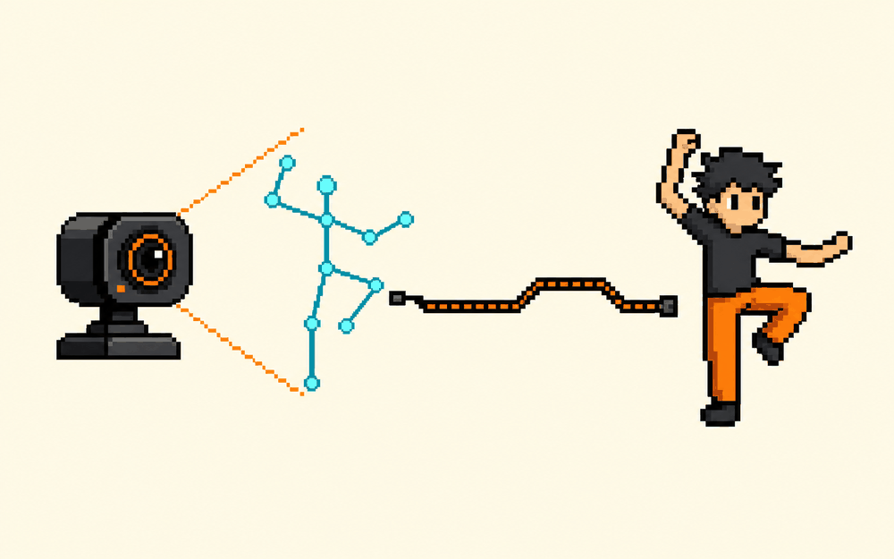

# 用身体控制游戏  ·  Control a game with your body

> 🕹 做个小游戏 · 难度：进阶 · 适合：初中→大专 · 约 4 个实验

## 体验（先玩）
一句话说明你会做出什么，然后去 playground 玩到结果：
**训练一个姿态/手势模型，用摄像头控制一个小游戏的角色。**

▶ Playground：https://teachablemachine.withgoogle.com

## 原理（它怎么工作）
_用人话讲清背后是什么，配一张示意图。别堆术语。_

TODO：补一段原理说明。

## 你能学到什么
- 姿态识别的输入输出
- 把模型接进游戏循环
- 实时性与准确率的权衡

## 怎么复现（自己做）
1. 打开参考仓库：https://github.com/ml5js/ml5-library
2. TODO：一步步 clone / run 的说明。
3. TODO：需要的工具 / API / key。

## 陪伴形象
本卡配套形象：`cherry-run`（Doris / Cherry 的一个表情，可做数字徽章 / NFT）。

---
_这张卡是 ai-atlas 的一个条目。想改进或新增卡片？欢迎提 PR，见根目录 README。_
